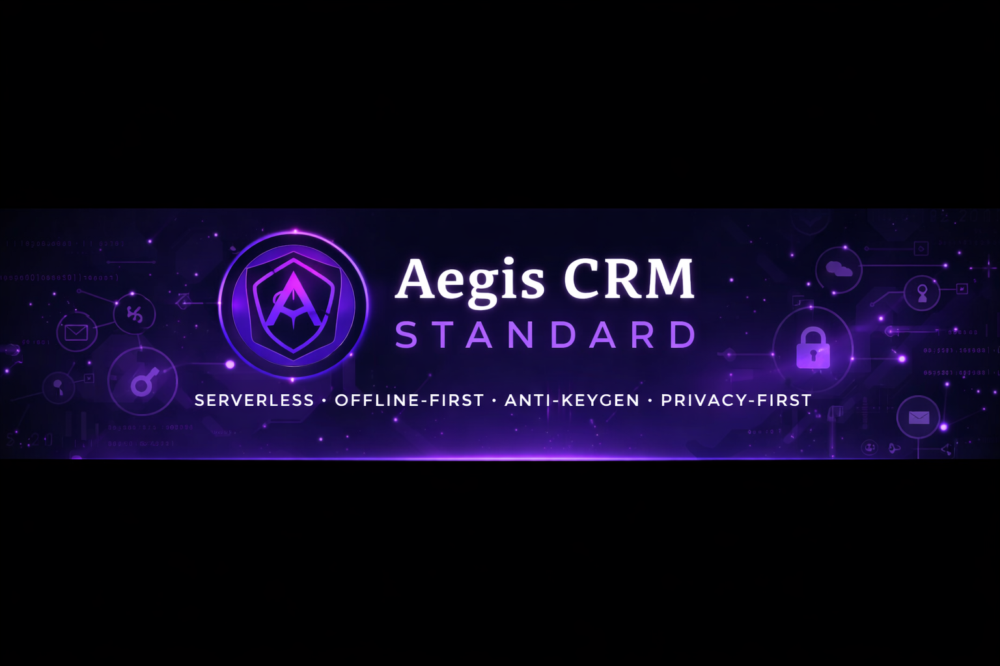
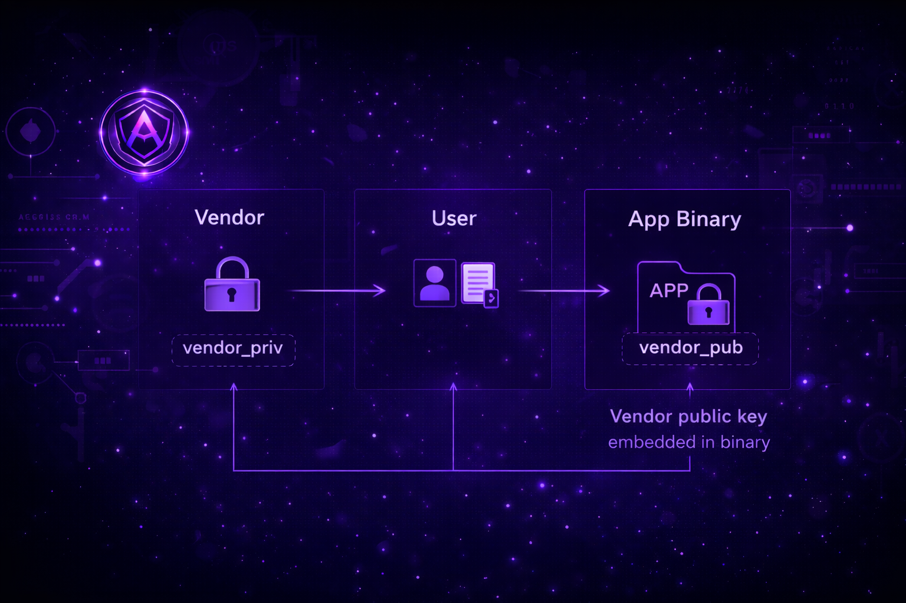

<p align="center">
  
</p>

<h1 align="center">Aegis CRM Standard</h1>

<p align="center">
  <b>Offline-first, serverless cryptographic license management standard</b>
</p>

<p align="center">
  <a href="LICENSE">
    
  </a>
  <a href="https://www.rust-lang.org">
    
  </a>
</p>

---

Aegis CRM is a **math-based license verification system** that works offline, in air-gapped environments, and without any central server dependency.

> **Note:** This is a generic licensing standard not tied to any specific product. All examples use placeholder names for demonstration purposes.

---

## 🎯 Core Principles

- **Math Trust > Server Trust** — Cryptographic proofs, not API calls
- **Offline-First** — Works in air-gapped environments  
- **Privacy-First** — No telemetry, no tracking, no phone-home
- **Anti-Keygen** — Proof-of-Possession prevents key sharing

---

## ✨ Features

- **Vendor-signed License Certificates (CERT)** with ECDSA secp256k1
- **Offline Proof-of-Possession (PoP)** challenge-response
- **Tier-based Licensing** (Lifetime Pro, Campus) with feature gates
- **Canonical CBOR** encoding for deterministic serialization
- **CLI Tool** for vendor key management and certificate operations

---

## 🧩 Architecture

<p align="center">
  
</p>

---

## 📦 Quick Start

### Installation

Add to your `Cargo.toml`:

```toml
[dependencies]
aegis-crm-core = "1.0"
```

### Basic Usage

```rust
use aegis_crm_core::{
    keys::{vendor_keygen, user_keygen},
    cert::{issue_cert, verify_cert, LicensePayload, PROTOCOL_VERSION},
    pop::{challenge, prove, verify},
};

// 1. Vendor: Generate signing keypair (cold storage!)
let vendor = vendor_keygen();
let user = user_keygen();

// 2. Vendor: Issue license certificate
let payload = LicensePayload {
    version: PROTOCOL_VERSION,
    tier: "lifetime_pro".to_string(),
    features: vec!["ALL".to_string()],
    expiry: None, // perpetual
    // ... other fields
};

let cert = issue_cert(&vendor.privkey, payload)?;

// 3. App: Verify certificate + PoP
verify_cert(&vendor.pubkey, &cert, now())?;

let nonce = challenge();
let sig = prove(&user.privkey, &nonce)?;
verify(&user.pubkey, &nonce, &sig)?;
```

See [**docs/CLI.md**](docs/CLI.md) for CLI tool usage.

---

## 📚 Documentation

| Document | Description |
|----------|-------------|
| [**SPEC.md**](SPEC.md) | Aegis CRM Standard v1.0 specification |
| [**docs/API.md**](docs/API.md) | Frozen public API contract |
| [**docs/CLI.md**](docs/CLI.md) | CLI command reference |
| [**STRUCTURE.md**](STRUCTURE.md) | Project structure overview |

**For Contributors:**
- [CONTRIBUTING.md](CONTRIBUTING.md) — Contribution guidelines  
- [internal/docs/](internal/docs/) — Development documentation (Quality, DoD, Tasks)

---

## 🔐 Security

- **secp256k1 ECDSA** for signatures
- **SHA-256** for hashing
- **Compressed SEC1** public keys (33 bytes)
- **Compact signatures** (64 bytes: r||s)
- **CSPRNG** via `getrandom`

See [SECURITY.md](SECURITY.md) for security policy and reporting.

---

## 🛠️ Development

```bash
# Format check
cargo fmt --check

# Lint
cargo clippy --workspace -- -D warnings

# Test
cargo test --workspace

# Generate fixtures
cargo run -p aegis-crm-core --example generate_fixtures
```

---

## 📄 License

Licensed under [**AGPL-3.0-or-later**](LICENSE).

**Commercial licenses available** — Contact for enterprise licensing.

---

## 🤝 Contributing

We welcome contributions! See [CONTRIBUTING.md](CONTRIBUTING.md) for guidelines.

**⚠️ Security:** Before committing, read [.github/PUSH_PROTECTION.md](.github/PUSH_PROTECTION.md) to prevent accidentally pushing private keys.

---

## 📞 Support

- **Issues:** [GitHub Issues](https://github.com/Falcoraxyz/Aegis-CRM-Standard/issues)
- **Security:** See [SECURITY.md](SECURITY.md)

---

**Aegis CRM Standard** — A generic licensing system for any product or service
